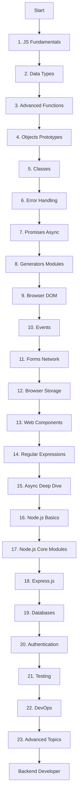

# JavaScript Backend Roadmap

Based on [javascript.info](https://javascript.info)

## Overview

## Sections

<b>1. JavaScript Fundamentals</b>

- Introduction
- Hello World
- Code Structure
- Variables
- Data Types
- Interaction
- Type Conversions
- Operators
- Comparisons
- Conditional Branching
- Logical Operators
- Nullish Coalescing
- Loops
- Switch
- Functions
- Function Expressions
- Arrow Functions
- Objects
- Object Methods this
- Constructors new
- Optional Chaining
- Symbol Type
- Object to Primitive

<b>2. Data Types Deep Dive</b>

- Numbers
- Strings
- Arrays
- Array Methods
- Iterables
- Map and Set
- WeakMap WeakSet
- Object keys values entries
- Destructuring
- Date and Time
- JSON Methods

<b>3. Advanced Functions</b>

- Recursion
- Rest Parameters
- Spread Syntax
- Closures
- var let const
- Global Object
- Function Object
- setTimeout setInterval
- Call apply bind
- Decorators Forwarding

<b>4. Objects and Prototypes</b>

- Property Flags
- Getters Setters
- Prototypes
- Prototypal Inheritance
- F.prototype
- Native Prototypes
- Prototype Methods

<b>5. Classes</b>

- Class Basic Syntax
- Class Inheritance
- Static Properties
- Private Protected
- Extending Built-ins
- instanceof
- Mixins

<b>6. Error Handling</b>

- try catch
- Custom Errors
- Error Object
- finally

<b>7. Promises and Async</b>

- Callbacks
- Promise Basics
- Promise Chaining
- Error Handling
- Promise API
- Promisification
- Microtasks
- async await

<b>8. Generators and Modules</b>

- Generators
- Async Iterators
- Async Generators
- Export Import
- Dynamic Imports

<b>9. Browser and DOM</b>

- DOM Tree
- DOM Navigation
- Searching Elements
- Node Properties
- Attributes Properties
- Modifying Document
- Styles and Classes
- Element Size Scrolling
- Window Size
- Coordinates

<b>10. Events</b>

- Introduction to Events
- Bubbling Capturing
- Event Delegation
- Browser Default Actions
- Custom Events
- Mouse Events
- Keyboard Events
- Form Elements
- Focus Blur
- Load Error Events

<b>11. Forms and Network</b>

- Form Properties
- Form Validation
- Fetch API
- FormData
- URL Objects

<b>12. Browser Storage</b>

- Cookies
- LocalStorage
- SessionStorage
- IndexedDB

<b>13. Web Components</b>

- Custom Elements
- Shadow DOM
- Templates

<b>14. Regular Expressions</b>

- Patterns Flags
- Character Classes
- Anchors
- Quantifiers

<b>15. Async Deep Dive</b>

- Event Loop
- Web Workers

<b>16. Node.js Basics</b>

- What is Node.js
- Installation
- First Program
- Modules in Node.js
- npm and Packages

<b>17. Node.js Core Modules</b>

- fs File System
- path
- http
- events
- stream
- os and process

<b>18. Express.js</b>

- Installation
- Routing
- Middleware
- Request Response
- Templates Views
- Error Handling

<b>19. Databases</b>

- MongoDB
- Mongoose ODM
- CRUD Operations
- PostgreSQL
- SQL Basics
- Database Design

<b>20. Authentication</b>

- JWT
- Bcrypt
- OAuth 2.0
- Sessions

<b>21. Testing</b>

- Jest
- Mocha
- Supertest
- Unit Testing
- Integration Testing
- E2E Testing

<b>22. DevOps</b>

- Docker
- CI CD
- Deployment
- Environment Variables
- Logging
- Monitoring

<b>23. Advanced Topics</b>

- WebSockets
- Socket.io
- Message Queues
- Redis Caching
- Microservices
- System Design
- Security Best Practices

