# JavaScript Backend Roadmap

Based on [javascript.info](https://javascript.info)

---

## Overview - Main Path

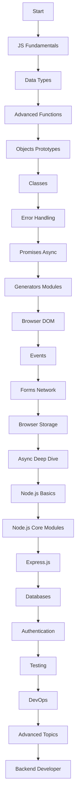

---

## 1. JavaScript Fundamentals

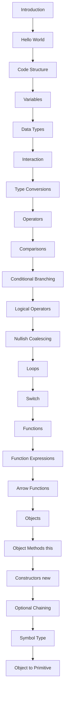

---

## 2. Data Types Deep Dive

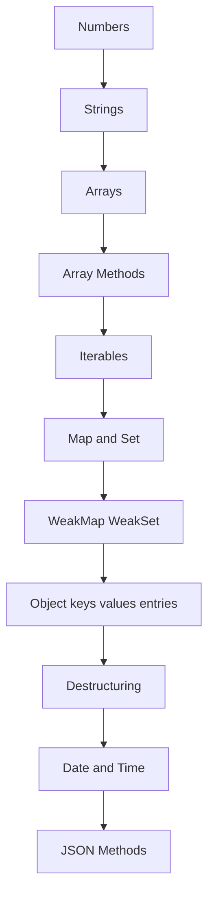

---

## 3. Advanced Functions

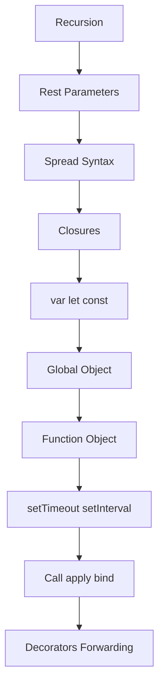

---

## 4. Objects and Prototypes

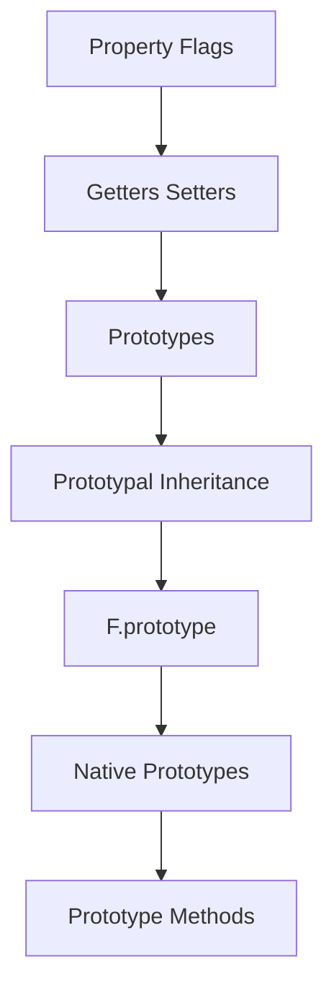

---

## 5. Classes

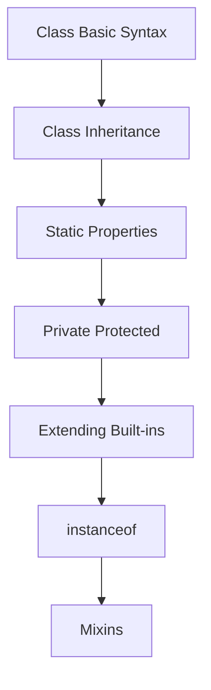

---

## 6. Error Handling

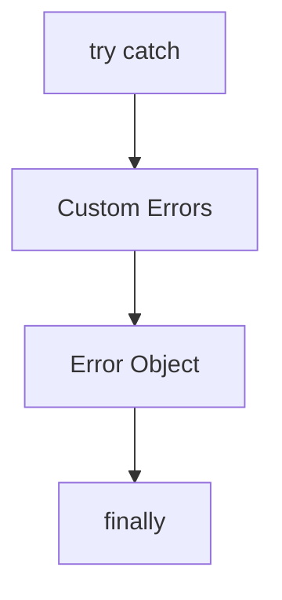

---

## 7. Promises and Async

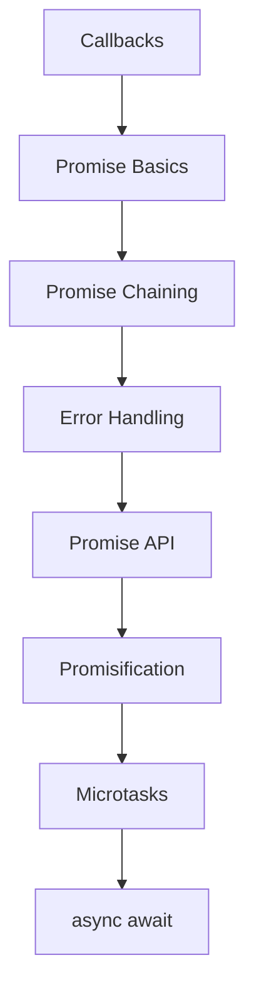

---

## 8. Generators and Modules

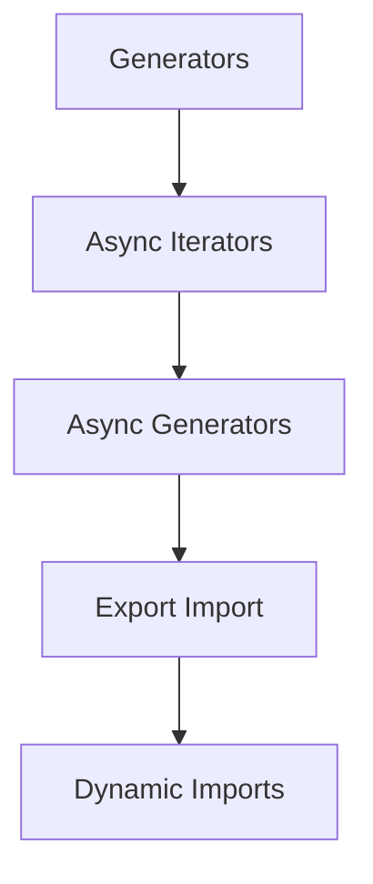

---

## 9. Browser and DOM

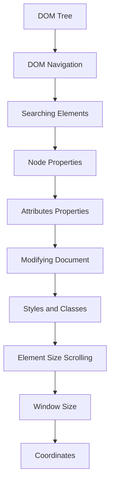

---

## 10. Events

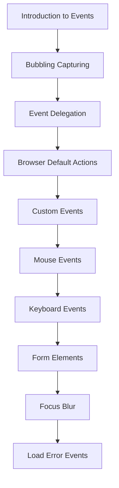

---

## 11. Forms and Network

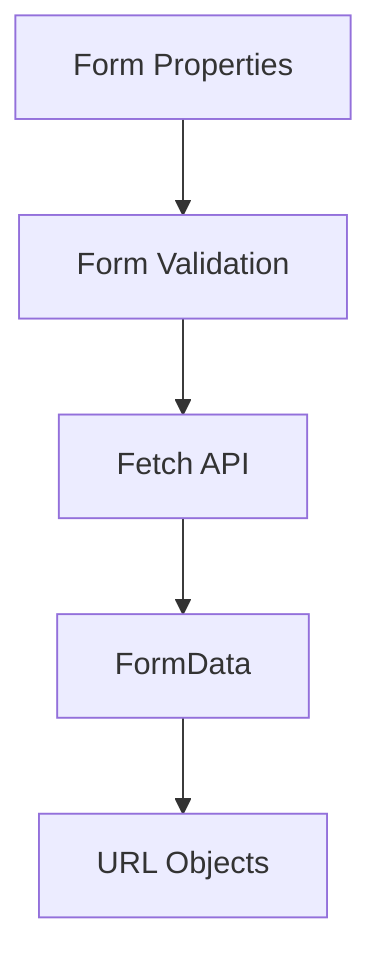

---

## 12. Browser Storage

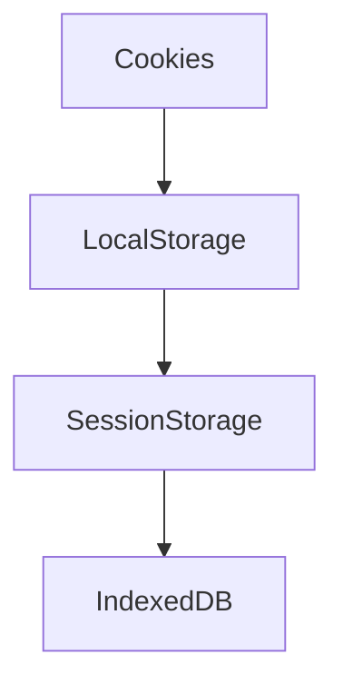

---

## 13. Web Components

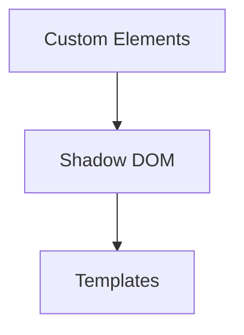

---

## 14. Regular Expressions

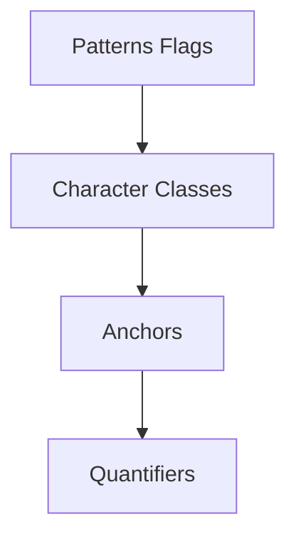

---

## 15. Async Deep Dive

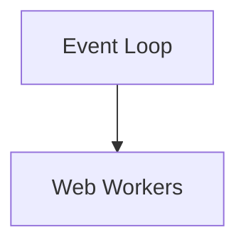

---

## 16. Node.js Basics

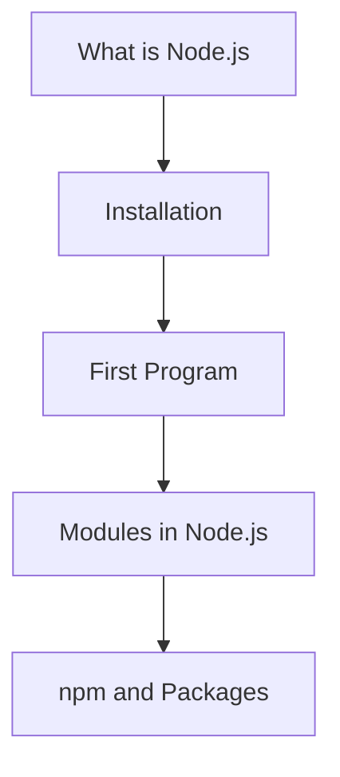

---

## 17. Node.js Core Modules

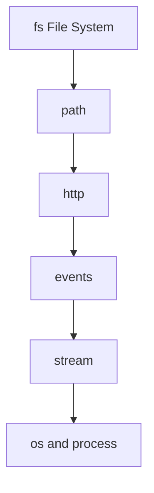

---

## 18. Express.js

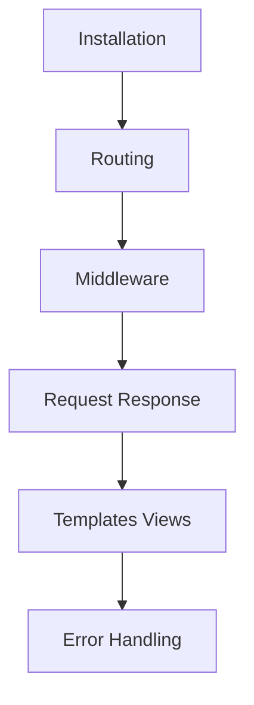

---

## 19. Databases

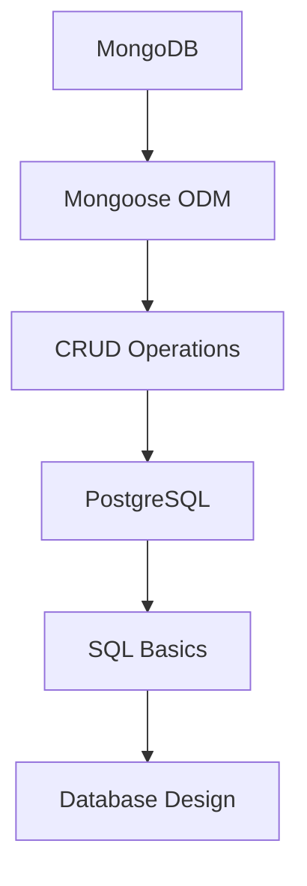

---

## 20. Authentication

```mermaid
graph TD;
    A[JWT]-->B[Bcrypt];
    B-->C[OAuth 2.0];
    C-->D[Sessions];
```

---

## 21. Testing

```mermaid
graph TD;
    A[Jest]-->B[Mocha];
    B-->C[Supertest];
    C-->D[Unit Testing];
    D-->E[Integration Testing];
    E-->F[E2E Testing];
```

---

## 22. DevOps

```mermaid
graph TD;
    A[Docker]-->B[CI CD];
    B-->C[Deployment];
    C-->D[Environment Variables];
    D-->E[Logging];
    E-->F[Monitoring];
```

---

## 23. Advanced Topics

```mermaid
graph TD;
    A[WebSockets]-->B[Socket.io];
    B-->C[Message Queues];
    C-->D[Redis Caching];
    D-->E[Microservices];
    E-->F[System Design];
    F-->G[Security Best Practices];
```

---

