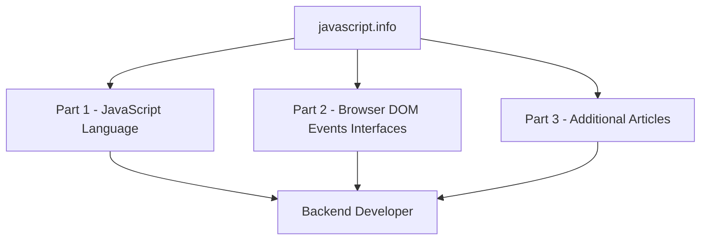

# JavaScript Backend Roadmap

Based on [javascript.info](https://javascript.info)

## Overview

## Parts

<b>Part I — The JavaScript Language</b>

- [An Introduction](https://javascript.info/js/getting-started)
- [JavaScript Fundamentals](https://javascript.info/js/first-steps)
- [Code Quality](https://javascript.info/js/code-quality)
- [Objects: The Basics](https://javascript.info/js/object-basics)
- [Data Types](https://javascript.info/js/data-types)
- [Advanced Working with Functions](https://javascript.info/js/advanced-functions)
- [Object Properties Configuration](https://javascript.info/js/object-properties)
- [Prototypes, Inheritance](https://javascript.info/js/prototypes)
- [Classes](https://javascript.info/js/classes)
- [Error Handling](https://javascript.info/js/error-handling)
- [Promises, async/await](https://javascript.info/js/async)
- [Generators, Advanced Iteration](https://javascript.info/js/generators-iterators)
- [Modules](https://javascript.info/js/modules)
- [Miscellaneous](https://javascript.info/js/js-misc)

<b>Part II — Browser: Document, Events, Interfaces</b>

- [Document](https://javascript.info/ui/document)
- [Introduction to Events](https://javascript.info/ui/events)
- [UI Events](https://javascript.info/ui/ui-events)
- [Forms, Controls](https://javascript.info/ui/forms-controls)
- [Document and Resource Loading](https://javascript.info/ui/loading)
- [Miscellaneous](https://javascript.info/ui/ui-misc)

<b>Part III — Additional Articles</b>

- [Frames and Windows](https://javascript.info/frames-and-windows)
- [Binary Data, Files](https://javascript.info/binary)
- [Network Requests](https://javascript.info/network)
- [Storing Data in the Browser](https://javascript.info/data-storage)
- [Animation](https://javascript.info/animation)
- [Web Components](https://javascript.info/web-components)
- [Regular Expressions](https://javascript.info/regular-expressions)

